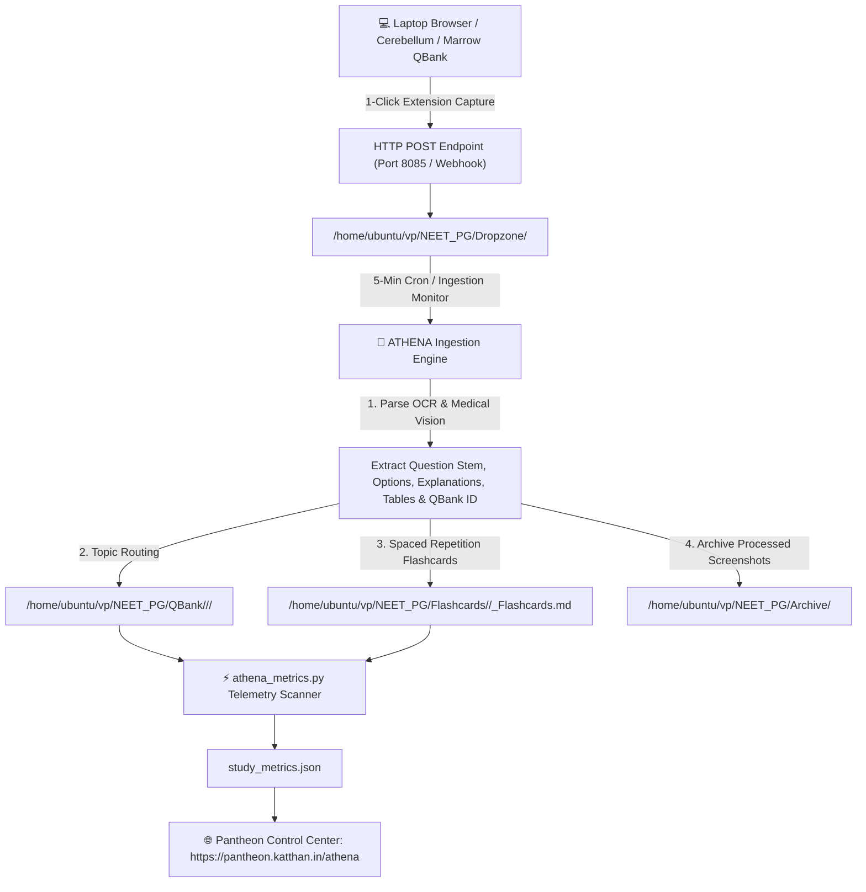

# 🦉 ATHENA & METIS — Medical Study & Anki Flashcard PWA System

> **Pantheon Education System** governing NEET PG Exam Preparation, QBank Analytics, and Spaced Repetition Flashcards.

---

## 🏛️ System Architecture

- **ATHENA (Goddess of Wisdom)**: Primary education & exam mastery agent. Tracks 300 Qs/day pacing across all 19 NEET PG medical subjects, calculates subject/subtopic mastery, and serves `athena_dashboard.html`.
- **METIS (Titaness of Wisdom & Learning)**: Flashcard Governor sub-agent reporting to ATHENA. Parses Markdown vault decks (`Flashcards/`), calculates dynamic SM-2 & FSRS 5.0 spaced repetition intervals, and serves `metis_dashboard.html`.

---

## ⚙️ ATHENA & PANTHEON NEET PG Automation Workflow

Here is the complete end-to-end automated workflow powering the NEET PG prep, QBank ingestion, flashcard generation, and telemetry tracking:



### 1. 📥 Step 1: Capture & Ingestion (Zero-Prompt Setup)
* **How You Solve:** You solve QBanks on your laptop (Cerebellum Academy, Marrow, Prepladder, etc.).
* **1-Click Upload:** Using the Pantheon GoFullPage Extension, clicking the icon captures the full question page + solution and automatically posts it via HTTP to your server on port 8085.
* **Payload:**
  * Full-resolution screenshot image (`.png`).
  * Metadata file (`.json`) containing page title, exact QBank URL, QBank ID, timestamp (IST), and pipeline tags.
  * Saved directly to `/home/ubuntu/vp/NEET_PG/Dropzone/`.

### 2. 🦉 Step 2: ATHENA Intelligence Processing
Every 5 minutes (or on demand), ATHENA inspects the Dropzone:
* **Vision Parsing:** Reads the question, options, statistical response percentages, detailed solution, educational diagrams, and unique Question ID (QBank ID: Qxxxxxxx).
* **Subject & Subtopic Taxonomy:** Automatically routes questions to their respective 19-Subject directory (e.g., `Obstetrics & Gynecology` → `Basic Obstetrics, Placenta & Fetal Physiology`).
* **Master QBank File Update:** Appends formatted markdown with high-yield clinical decision tables, option explanations, and take-home messages to: `/home/ubuntu/vp/NEET_PG/QBank/<Subject>/<Topic>/QBank_<Topic>.md`
* **Flashcard Generation:** Generates cloze-deletion (`{{c1::...}}`) and Anki-style Q&A flashcards with takeaway notes to: `/home/ubuntu/vp/NEET_PG/Flashcards/<Subject>/<Topic>_Flashcards.md`
* **Archiving:** Moves processed screenshots to `/home/ubuntu/vp/NEET_PG/Archive/`.

### 3. 📊 Step 3: Real-Time Telemetry & Metrics Scanner (`athena_metrics.py`)
The telemetry engine automatically calculates:
* **Daily Target Volume:** Tracks progress against your 300 Questions/day goal.
* **Topic Volume & Pacing:** Tracks the volume of questions solved per subtopic against a baseline target (e.g., Arrhythmias: 82% High Volume, Cardiology: 58% Building Volume).
* **Question-Type Distribution:** Categorizes questions into Clinical Vignette, Except/Negative, Multi-Statement Evaluation, and Simple Direct Recall.
* **Endurance & Speed Gauge:** Measures solving speed (Q/hr) and endurance rating (0–100).
* **Concentration Score:** Tracks focus sessions, tab switches, and drift via the Page Visibility API.

### 4. 🌐 Step 4: Live Pantheon Control Center & METIS Integration
* **Public URL:** Accessible anywhere at `https://pantheon.katthan.in/athena`.
* **Pantheon PWA Tab:** Integrated directly into your main Pantheon Web App as the NEET PG Analytics 🎯 tab under ATHENA 🦉 / METIS.
* **METIS Flashcards Governor:** Syncs with your Anki Spaced Repetition engine, displaying due cards, retention rate (FSRS/SM-2 algorithm), and review queues.
* **Pomodoro Focus Block Timer:** Built-in 25m/50m focus timer with audible alerts for exam day endurance training.

---

## 🎴 METIS Anki Flashcards PWA Features

1. **Dual Spaced Repetition Engines (Anki SM-2 / FSRS-6)**:
   - `metis_sm2.py` — a from-scratch classic Anki SM-2 scheduler (ease factor, learning/relearning steps, graduating/easy intervals). The `fsrs` PyPI package has no SM-2 mode, so this is a real implementation, not a re-skin.
   - `metis_db.py` — FSRS-6 via [py-fsrs](https://pypi.org/project/fsrs/) (the package tracks the FSRS algorithm version; 6.3.1 implements FSRS-6, 21 weights).
   - Card state progression (`new` &rarr; `learning` &rarr; `review` &rarr; `relearning`) is shared between both engines so switching algorithms doesn't require separate storage.
2. **Interactive Study Player**:
   - Keyboard Navigation: `SPACE` to reveal answer, `1` (Again), `2` (Hard), `3` (Good), `4` (Easy).
   - Undo last review.
3. **⚙️ Settings tab (per user)**:
   - Toggle between **FSRS-6** and **Anki SM-2 Standard** — switching is per-user and takes effect the next time each card is reviewed (in-progress scheduling under the old algorithm resets per-card on first touch; full review history is always kept).
   - FSRS: desired retention, maximum interval, learning/relearning steps, interval fuzzing.
   - SM-2: starting ease, graduating interval, easy interval, learning/relearning steps.
   - **New cards/day** and **max reviews/day** — real, persistently-tracked daily caps (not just a per-session batch size), enforced independently of each other in `get_due_queue()`.
   - **Personalized FSRS weights**: one-click optimization via `fsrs.Optimizer` (gradient descent, PyTorch backend) fits the 21 FSRS weights to your own review history instead of the generic stock defaults. Requires a substantial review history — the library's own internal floor is ~512 non-same-day reviews of cards already in the Review state; below that it silently no-ops, so METIS explicitly detects and reports that instead of pretending it worked.
4. **PWA Standalone & Offline Support**:
   - Web App Manifest (`manifest.json`) and Service Worker (`sw.js`) for desktop and mobile home screen installation.

---

## 📁 Repository Structure

```
pantheon-athena-metis/
├── athena_dashboard.html   # ATHENA NEET PG Analytics & Control Center
├── athena_metrics.py       # QBank & Subject Mastery Scanner
├── metis_dashboard.html    # METIS Anki Flashcards Spaced Repetition PWA
├── metis_db.py             # Multi-user DB layer: auth, decks/cards, settings, FSRS/SM-2 scheduling, optimizer
├── metis_sm2.py            # Classic Anki SM-2 scheduler (ease factor, learning/relearning steps)
├── metis_flashcards.py     # One-off Markdown vault -> deck importer
├── metis_migrate.py        # One-off Markdown -> metis.db migration script
├── dropzone_server.py      # HTTP server: dropzone uploads, ATHENA metrics API, METIS API routes
├── manifest.json           # Web App Manifest for PWA installation
├── sw.js                   # Service Worker for offline asset caching
├── study_metrics.json      # Single Source of Truth metrics file
├── metis.db                # SQLite: users, cards, decks, per-user scheduling state, settings
├── Flashcards/             # Subject Markdown Decks (Anatomy, Medicine, Surgery, etc.)
└── QBank/                  # Subject Question Banks
```

---

## 🚀 Execution Commands

### Scan QBank Metrics
```bash
python3 athena_metrics.py
```

### Run METIS Flashcards Governor
```bash
python3 metis_flashcards.py
```

---
*Governed by: ZEUS ⚡, ATHENA 🦉 & METIS 🦉*
